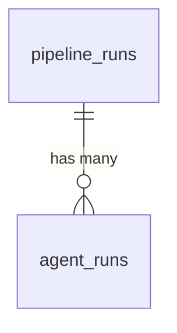

# Data Model

Cloud Agent Harness uses RDS Postgres 16 with two tables. The base schema is created by `scripts/init-db-schema.sql`; subsequent migrations extend it.

## Tables

### `pipeline_runs`

One row per pipeline execution. Tracks the overall state of a feature request from intake through PR delivery.

| Column | Type | Default | Description |
|--------|------|---------|-------------|
| `id` | UUID | `gen_random_uuid()` | Primary key |
| `project_id` | TEXT | | Project identifier from the incoming job message |
| `status` | TEXT | `'pending'` | Lifecycle state: `pending`, `running`, `completed`, `failed` |
| `phase_current` | INTEGER | `0` | Current GSD phase number being executed |
| `phase_total` | INTEGER | `0` | Total phases planned for this run |
| `config` | JSONB | `'{}'` | Arbitrary run configuration from the job message |
| `current_stage` | TEXT | `'intake'` | Active pipeline stage (see Stage Lifecycle below) |
| `repo_url` | TEXT | | Repository URL being worked on |
| `branch` | TEXT | | Target branch |
| `feature_description` | TEXT | | What the user asked for |
| `created_at` | TIMESTAMPTZ | `NOW()` | Row creation timestamp |
| `updated_at` | TIMESTAMPTZ | `NOW()` | Auto-updated via trigger on every row modification |

### `agent_runs`

One row per agent task within a pipeline. Each stage may spawn one or more agent tasks (e.g., the execute stage runs one task per plan/wave).

| Column | Type | Default | Description |
|--------|------|---------|-------------|
| `id` | UUID | `gen_random_uuid()` | Primary key |
| `pipeline_run_id` | UUID | | Foreign key to `pipeline_runs.id` |
| `phase` | INTEGER | | GSD phase number this task belongs to |
| `plan_name` | TEXT | | Plan identifier (e.g., `research`, `02-01`, `verify`) |
| `wave` | INTEGER | `1` | Execution wave within the phase |
| `status` | TEXT | `'pending'` | Task state: `pending`, `running`, `completed`, `failed` |
| `task_key` | TEXT | | Deterministic ID for idempotent upsert (format: `{runId}:{phase}:{plan}:{wave}`) |
| `session_id` | TEXT | | Agent session identifier from the SDK |
| `model` | TEXT | | Claude model used (e.g., `claude-sonnet-4-20250514`) |
| `input_tokens` | INTEGER | `0` | Input token count |
| `output_tokens` | INTEGER | `0` | Output token count |
| `cost_usd` | NUMERIC(10,6) | `0` | Execution cost in USD |
| `duration_ms` | INTEGER | `0` | Task execution duration |
| `error_message` | TEXT | | Error details on failure |
| `artifacts` | JSONB | `'[]'` | S3 keys of artifacts produced by this task |
| `started_at` | TIMESTAMPTZ | | When the agent task began |
| `completed_at` | TIMESTAMPTZ | | When the agent task finished |
| `created_at` | TIMESTAMPTZ | `NOW()` | Row creation timestamp |

## Indexes

| Index | Table | Column(s) | Type | Purpose |
|-------|-------|-----------|------|---------|
| `idx_agent_runs_pipeline` | `agent_runs` | `pipeline_run_id` | B-tree | Find all tasks for a pipeline run |
| `idx_agent_runs_status` | `agent_runs` | `status` | B-tree | Query tasks by completion state |
| `idx_agent_runs_task_key` | `agent_runs` | `task_key` | Unique partial (`WHERE task_key IS NOT NULL`) | Idempotent upsert conflict target |
| `idx_pipeline_runs_status` | `pipeline_runs` | `status` | B-tree | Find active/completed runs |

## Entity Relationship Diagram



One pipeline run has many agent runs. Each agent run belongs to exactly one pipeline run.

## Stage Lifecycle

A pipeline run progresses through 7 stages in order. The `current_stage` column on `pipeline_runs` reflects the active stage:

```
intake -> research -> plan -> approve -> execute -> verify -> pr -> completed
```

| Stage | What happens |
|-------|-------------|
| `intake` | Creates the `pipeline_runs` row, validates input, dispatches to research |
| `research` | Spawns research agent(s) in Daytona sandbox |
| `plan` | Spawns planning agent to create execution plans |
| `approve` | Auto-approve gate (Slack approval added in Phase 3) |
| `execute` | Spawns executor agents — one per plan/wave, sequential |
| `verify` | Spawns verifier agent to check execution results |
| `pr` | Creates pull request from accumulated artifacts (Phase 3) |
| `completed` | Terminal state — pipeline finished successfully |

Stage transitions are managed by the stage router (`src/cloud/pipeline/stage-router.ts`), which receives SQS messages and dispatches to the appropriate handler.

## Idempotency

The `task_key` column prevents duplicate agent executions on pipeline replay. The key is deterministic:

```
{runId}:{stage}:{plan}:{wave}
```

When a stage handler runs, it calls `upsertAgentRun()` which executes:

```sql
INSERT INTO agent_runs (..., task_key)
VALUES (...)
ON CONFLICT (task_key) DO UPDATE SET
  status = EXCLUDED.status,
  started_at = CASE
    WHEN agent_runs.status IN ('completed', 'failed') THEN agent_runs.started_at
    ELSE EXCLUDED.started_at
  END
```

This means:
- First execution: inserts a new row
- Replay of the same task: updates status but preserves timing for already-finished tasks
- No duplicate rows are ever created for the same task

## Resume

When a pipeline fails and restarts, the resume module (`src/cloud/pipeline/resume.ts`) queries:

1. `pipeline_runs.current_stage` to determine where to restart
2. `agent_runs WHERE status = 'completed'` to get the skip list

The stage handler then checks the skip list before dispatching each task, skipping any task whose `task_key` is already completed.

## Migrations

| Migration | File | What it does |
|-----------|------|-------------|
| Base schema | `scripts/init-db-schema.sql` | Creates `pipeline_runs` and `agent_runs` tables with indexes and `updated_at` trigger |
| 002 | `scripts/migrate-002-idempotency.sql` | Adds `task_key` (with unique index), `current_stage`, `repo_url`, `branch`, `feature_description` |

Run migrations in order after CDK deploy:

```bash
source infra/.env
psql "$DATABASE_URL" -f scripts/init-db-schema.sql
psql "$DATABASE_URL" -f scripts/migrate-002-idempotency.sql
```

All migrations use `IF NOT EXISTS` / `ADD COLUMN IF NOT EXISTS` and are safe to run repeatedly.
