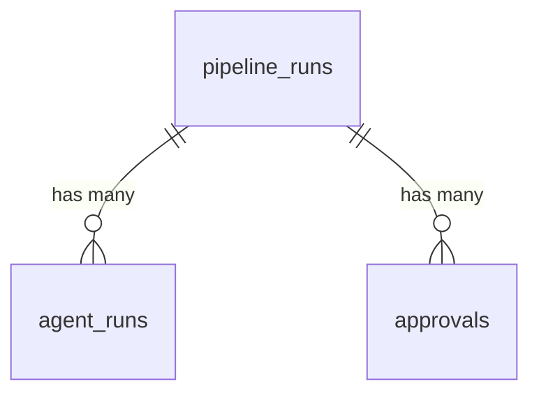

# Data Model

> Reflects the implemented state as of 2026-04-22 (migrations 001–005 applied).

Cloud Agent Harness uses RDS Postgres 16. The base schema is created by `scripts/init-db-schema.sql`; subsequent migrations extend it. Phase 3 added the `approvals` table and integration columns on `pipeline_runs`. Migration 004 added `approval_type` to discriminate plan approvals from risk escalations. Migration 005 added cache-token columns on `agent_runs` to fully account for Anthropic prompt-cache pricing.

## Tables

### `pipeline_runs`

One row per pipeline execution. Tracks the overall state of a feature request from intake through PR delivery.

| Column | Type | Default | Description |
|--------|------|---------|-------------|
| `id` | UUID | `gen_random_uuid()` | Primary key |
| `project_id` | TEXT | | Project identifier from the incoming job message |
| `status` | TEXT | `'pending'` | Lifecycle state: `pending`, `running`, `completed`, `failed` |
| `phase_current` | INTEGER | `0` | Current GSD phase number being executed |
| `phase_total` | INTEGER | `0` | Total phases planned for this run |
| `config` | JSONB | `'{}'` | Arbitrary run configuration from the job message |
| `current_stage` | TEXT | `'intake'` | Active pipeline stage (see Stage Lifecycle below) |
| `repo_url` | TEXT | | Repository URL being worked on |
| `branch` | TEXT | | Target branch |
| `feature_description` | TEXT | | What the user asked for |
| `created_at` | TIMESTAMPTZ | `NOW()` | Row creation timestamp |
| `feature_branch` | TEXT | | Feature branch name (Phase 3: set by intake, e.g., `cah/{run_id_short}/{slug}`) |
| `linear_parent_ticket_id` | TEXT | | Linear parent ticket ID (Phase 3: set by intake) |
| `updated_at` | TIMESTAMPTZ | `NOW()` | Auto-updated via trigger on every row modification |

### `agent_runs`

One row per agent task within a pipeline. Each stage may spawn one or more agent tasks (e.g., the execute stage runs one task per plan/wave).

| Column | Type | Default | Description |
|--------|------|---------|-------------|
| `id` | UUID | `gen_random_uuid()` | Primary key |
| `pipeline_run_id` | UUID | | Foreign key to `pipeline_runs.id` |
| `phase` | INTEGER | | GSD phase number this task belongs to |
| `plan_name` | TEXT | | Plan identifier (e.g., `research`, `02-01`, `verify`) |
| `wave` | INTEGER | `1` | Execution wave within the phase |
| `status` | TEXT | `'pending'` | Task state: `pending`, `running`, `completed`, `failed` |
| `task_key` | TEXT | | Deterministic ID for idempotent upsert (format: `{runId}:{phase}:{plan}:{wave}`) |
| `session_id` | TEXT | | Agent session identifier from the SDK |
| `model` | TEXT | | Claude model used (e.g., `claude-sonnet-4-6`); resolved in the entrypoint via `loadConfig` + `model_profile` map |
| `input_tokens` | INTEGER | `0` | Non-cached input token count |
| `output_tokens` | INTEGER | `0` | Output token count |
| `cache_read_tokens` | INTEGER | `0` | Input tokens served from prompt cache (migration 005) |
| `cache_creation_tokens` | INTEGER | `0` | Input tokens written to prompt cache (migration 005) |
| `cost_usd` | NUMERIC(10,6) | `0` | Execution cost in USD |
| `duration_ms` | INTEGER | `0` | Task execution duration |
| `error_message` | TEXT | | Error details on failure |
| `artifacts` | JSONB | `'[]'` | S3 keys of artifacts produced by this task |
| `started_at` | TIMESTAMPTZ | | When the agent task began |
| `completed_at` | TIMESTAMPTZ | | When the agent task finished |
| `created_at` | TIMESTAMPTZ | `NOW()` | Row creation timestamp |

## Indexes

| Index | Table | Column(s) | Type | Purpose |
|-------|-------|-----------|------|---------|
| `idx_agent_runs_pipeline` | `agent_runs` | `pipeline_run_id` | B-tree | Find all tasks for a pipeline run |
| `idx_agent_runs_status` | `agent_runs` | `status` | B-tree | Query tasks by completion state |
| `idx_agent_runs_task_key` | `agent_runs` | `task_key` | Unique partial (`WHERE task_key IS NOT NULL`) | Idempotent upsert conflict target |
### `approvals` (Phase 3)

One row per approval request. Created when the pipeline hits the approve stage; resolved when a user clicks Approve or Reject in Slack.

| Column | Type | Default | Description |
|--------|------|---------|-------------|
| `id` | UUID | `gen_random_uuid()` | Primary key |
| `pipeline_run_id` | UUID | | Foreign key to `pipeline_runs.id` |
| `token` | UUID | `gen_random_uuid()` | Unique token embedded in Slack button payload (122 bits of entropy) |
| `status` | TEXT | `'pending'` | Approval state: `pending`, `approved`, `rejected` |
| `approval_type` | TEXT | `'plan_approval'` | Discriminator: `plan_approval` advances to next stage; `risk_escalation` re-enters current stage (migration 004) |
| `slack_channel` | TEXT | | Slack channel or U-prefixed user ID for DM where the approval message was sent |
| `slack_message_ts` | TEXT | | Slack message timestamp (for updating the message after resolution) |
| `requested_by` | TEXT | | Pipeline context: who/what triggered the run |
| `resolved_by` | TEXT | | Slack username of the person who approved/rejected |
| `requested_at` | TIMESTAMPTZ | `NOW()` | When the approval was requested |
| `resolved_at` | TIMESTAMPTZ | | When the approval was approved/rejected |

## Indexes

| Index | Table | Column(s) | Type | Purpose |
|-------|-------|-----------|------|---------|
| `idx_agent_runs_pipeline` | `agent_runs` | `pipeline_run_id` | B-tree | Find all tasks for a pipeline run |
| `idx_agent_runs_status` | `agent_runs` | `status` | B-tree | Query tasks by completion state |
| `idx_agent_runs_task_key` | `agent_runs` | `task_key` | Unique partial (`WHERE task_key IS NOT NULL`) | Idempotent upsert conflict target |
| `idx_pipeline_runs_status` | `pipeline_runs` | `status` | B-tree | Find active/completed runs |
| `idx_approvals_token` | `approvals` | `token` | B-tree | Token lookup from Slack webhook (Phase 3) |
| `idx_approvals_pipeline_run` | `approvals` | `pipeline_run_id` | B-tree | Find approvals for a pipeline run (Phase 3) |
| `idx_approvals_type` | `approvals` | `approval_type` | B-tree | Filter by approval type for routing (migration 004) |

## Entity Relationship Diagram



One pipeline run has many agent runs and zero or more approval requests. Each agent run and each approval belongs to exactly one pipeline run.

## Stage Lifecycle

A pipeline run progresses through 7 stages in order. The `current_stage` column on `pipeline_runs` reflects the active stage:

```
intake -> research -> plan -> approve -> execute -> verify -> pr -> completed
                                 │
                                 ├── status: 'paused' (waiting for Slack)
                                 │
                                 └── Slack webhook resumes -> execute
```

### Pipeline Status Values

| Status | Meaning |
|--------|---------|
| `pending` | Run created but not yet started |
| `running` | Pipeline actively progressing through stages |
| `paused` | Waiting for external input (Slack approval) |
| `completed` | Pipeline finished successfully — PR delivered |
| `failed` | Pipeline failed at some stage |
| `rejected` | User rejected the plan in Slack |

### Stage Handlers

| Stage | What happens |
|-------|-------------|
| `intake` | Creates `pipeline_runs` row (seeds `phase_current` from incoming context), feature branch (Phase 3), Linear parent ticket (Phase 3) |
| `research` | Spawns research agent in Daytona sandbox |
| `plan` | Spawns planning agent to create execution plans |
| `approve` | Sends Block Kit message to Slack DM (or channel), writes `pending` approval row, returns `paused` (Phase 3) |
| `execute` | Single sandbox dispatch per phase; entrypoint creates a task branch, runs `gsd.runPhase()`, commits + pushes |
| `verify` | Spawns verifier agent to check execution results |
| `pr` | Opens GitHub PR `featureBranch → base`, links to Linear ticket (v1: fails when no commits accumulated on featureBranch — Phase 5 fix) |
| `completed` | Terminal state — pipeline finished successfully |

Stage transitions are managed by the stage router (`src/cloud/pipeline/stage-router.ts`), which receives SQS messages and dispatches to the appropriate handler. The router treats `paused` as a terminal state for the approve stage — the Slack webhook Lambda owns pipeline resumption via SQS.

## Idempotency

The `task_key` column prevents duplicate agent executions on pipeline replay. The key is deterministic:

```
{runId}:{stage}:{plan}:{wave}
```

When a stage handler runs, it calls `upsertAgentRun()` which executes:

```sql
INSERT INTO agent_runs (..., task_key)
VALUES (...)
ON CONFLICT (task_key) DO UPDATE SET
  status = EXCLUDED.status,
  started_at = CASE
    WHEN agent_runs.status IN ('completed', 'failed') THEN agent_runs.started_at
    ELSE EXCLUDED.started_at
  END
```

This means:
- First execution: inserts a new row
- Replay of the same task: updates status but preserves timing for already-finished tasks
- No duplicate rows are ever created for the same task

## Resume

When a pipeline fails and restarts, the resume module (`src/cloud/pipeline/resume.ts`) queries:

1. `pipeline_runs.current_stage` to determine where to restart
2. `agent_runs WHERE status = 'completed'` to get the skip list

The stage handler then checks the skip list before dispatching each task, skipping any task whose `task_key` is already completed.

## Approval Flow (Phase 3)

The `approvals` table implements a token-based pause/resume pattern for the Slack approval gate:

```
Approve Stage Handler              Slack Webhook Lambda
─────────────────────              ────────────────────
1. Send Block Kit message          1. Verify HMAC signature
2. INSERT INTO approvals           2. SELECT by token
   (token, status='pending')       3. UPDATE status + resolved_by
3. Return status: 'paused'         4. On approve: SQS -> Execute
   (router stops advancing)        5. On reject: pipeline 'rejected'
```

Key properties:
- **Token entropy**: UUID v4 (122 bits) — not guessable
- **Idempotent resolution**: Only `pending` tokens can be resolved; already-resolved tokens return 200 with no side effects
- **No long-lived state**: The pipeline is fully checkpointed in Postgres. The webhook Lambda reconstructs a `StageMessage` from `pipeline_runs` data to resume via SQS.

## Migrations

| Migration | File | What it does |
|-----------|------|-------------|
| Base schema | `scripts/init-db-schema.sql` | Creates `pipeline_runs` and `agent_runs` tables with indexes and `updated_at` trigger |
| 002 | `scripts/migrate-002-idempotency.sql` | Adds `task_key` (with unique index), `current_stage`, `repo_url`, `branch`, `feature_description` |
| 003 | `scripts/migrate-003-approvals.sql` | Creates `approvals` table with indexes; adds `feature_branch` and `linear_parent_ticket_id` to `pipeline_runs` (Phase 3) |
| 004 | `scripts/migrate-004-approval-type.sql` | Adds `approval_type` to `approvals` (default `'plan_approval'`) and `idx_approvals_type` (Phase 4) |
| 005 | `scripts/migrate-005-token-tracking.sql` | Adds `cache_read_tokens` and `cache_creation_tokens` to `agent_runs` for full Anthropic prompt-cache accounting |

Run migrations in order after CDK deploy:

```bash
source infra/.env
psql "$DATABASE_URL" -f scripts/init-db-schema.sql
psql "$DATABASE_URL" -f scripts/migrate-002-idempotency.sql
psql "$DATABASE_URL" -f scripts/migrate-003-approvals.sql
npx tsx scripts/apply-migration-004.ts   # uses Secrets Manager for the connection string
npx tsx scripts/apply-migration-005.ts
```

All migrations use `IF NOT EXISTS` / `ADD COLUMN IF NOT EXISTS` and are safe to run repeatedly.
